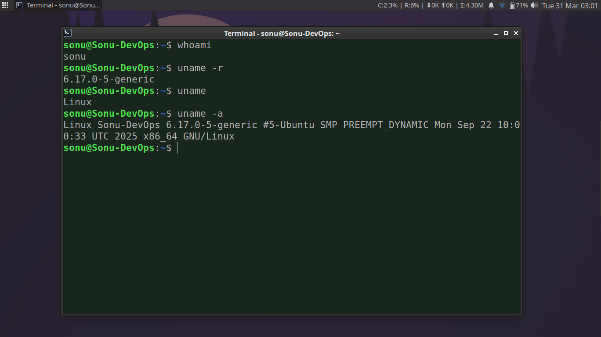
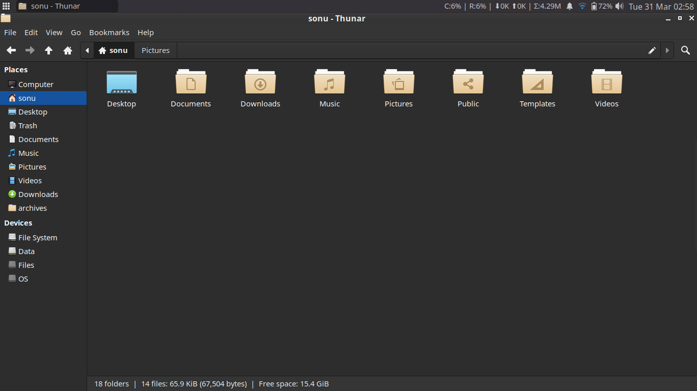

# 🚀 Switched to Linux (Xubuntu) from Windows 11 — A New Journey Begins!

**I’ve finally made the move from Windows 11 to Linux (Xubuntu)… and honestly, it’s been a very interesting experience so far.**

What I love the most about Linux is **customization**. You can tweak almost everything exactly the way you want.

But at the same time, that’s also the biggest challenge — because **everything is customizable.**

If you don’t know where things are or how they work, even simple tasks can become frustrating. It takes time to get comfortable with a new OS, especially when you're used to a completely different environment.

## 🧠 What I explored while learning Xubuntu:

Since I wanted to understand the system deeply, I decided to build something useful for myself —

⚙️ A Custom Resource Monitor

* CPU Usage (%)

* RAM Usage (%)

* Internet Upload Speed

* Internet Download Speed

* Total Data Consumed (Daily)

This hands-on approach helped me understand the system much better.

## ⏳ Why I was inactive:

I was spending time exploring and getting familiar with the OS. And trust me, working on an unknown system without knowing where things are can slow you down a lot.

## 📸 Here are some snapshots of my Xubuntu setup!

Excited to keep learning and building more on Linux 🚀

## 📂 What I Made

### 1️⃣ monitor.sh

Main script responsible for collecting and displaying system metrics.

Key features: - Auto-detects active network interface - Calculates CPU
and RAM usage in real-time - Tracks upload/download speed using
`/sys/class/net` - Fetches total daily data using `vnstat` - Handles
**online vs offline modes gracefully** - Outputs formatted text for
panel integration

------------------------------------------------------------------------

### 2️⃣ daily_data_alert.sh

A background alert system for monitoring daily data usage.

Key features: - Checks total daily data usage via `vnstat` - Converts
units (GB → MB) safely - Triggers notification when usage exceeds limit
(default: 1000 MB) - Plays alert sound using `paplay` - Prevents
duplicate alerts using a flag file

------------------------------------------------------------------------

## 💡 Why This Matters

Instead of relying on heavy monitoring tools, this solution is:

-   Lightweight ⚡
-   Fully customizable 🔧
-   Script-driven (DevOps mindset) 🧠
-   Easily portable across systems 💻

------------------------------------------------------------------------

## 📸 Preview

### 1. Online:

### 2. Offline:

### 3. Data Alert (Simulated with 10MB)

------------------------------------------------------------------------

## 🏁 Final Thoughts

This project represents more than just a script ---  
it reflects my transition into Linux and deeper system-level understanding.